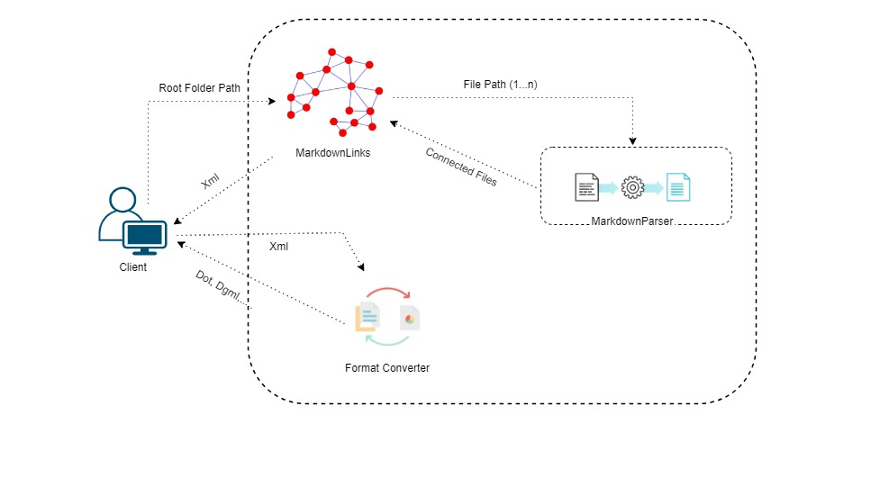

# Markdown Plugin- User Guide
Plugin will be available as nuget package

## How it works!!!!

# Overview
 This plugin can be installed in a client app and can be used as follows:
 1. It will pass the root directory to the MarkdownLinks and will recieve XmlDocument as an output, which consists of Node and Edges.
 2. It will pass recieved XmlDocument along with the required format as a string to format converter and recieves requested formated XmlDocument e.g:"dgml","dot".....



## Usage
```
var xmlDocument = markdown.GetLinks(rootDirectory);
var dgmlDocument = format.ConvertFormat(xmlDocument,"dgml");
var dgmlFile = dgmlDocument.Save(fileName.dgml);
```

## Context for MarkdownParser


